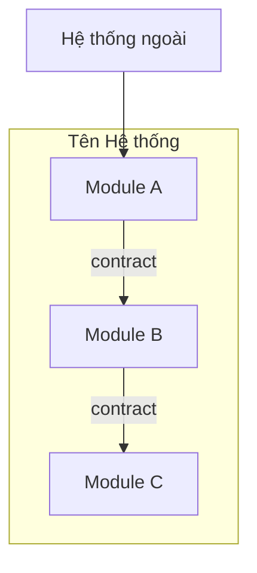

# Viết Overview Spec

Hướng dẫn chi tiết viết spec tổng thể cho dự án (dùng trong `aiteam-kickoff`).

## Quy trình

1. **Phân tích domain** — chia hệ thống thành modules dựa trên bounded contexts
2. **Vẽ kiến trúc** — mermaid component diagram thể hiện modules và quan hệ
3. **Định nghĩa contracts** — xác định interface giữa các modules
4. **Phân công ownership** — mỗi module có 1 owner duy nhất

## Cách chia modules

- Mỗi module nên có high cohesion (làm 1 việc rõ ràng) và low coupling (ít phụ thuộc)
- Module ít phụ thuộc nhất → dễ bắt đầu implement sớm
- Tránh chia quá nhỏ (overhead coordination) hoặc quá lớn (khó song song)

## Cách viết contracts

Mỗi cặp modules tương tác cần 1 contract file:
- Xác định hướng: Module A gọi Module B hay ngược lại?
- Mô tả interface signatures (params, return types)
- Mô tả error handling — ai chịu trách nhiệm xử lý lỗi gì
- Dùng template `contract.md`

## Cách vẽ mermaid

- Mỗi module là 1 node
- Mỗi contract là 1 edge có label
- Group modules trong subgraph
- Thêm external systems nếu có
