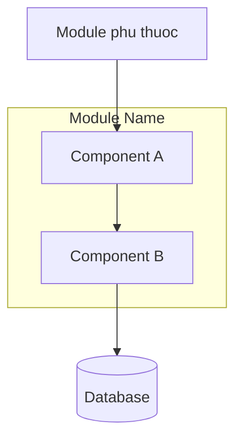

# Module: <Ten Module>

## 1. Overview & Requirements

### Muc dich
<!-- Module nay lam gi, giai quyet phan nao cua bai toan tong the -->

### User Stories lien quan
- La [vai tro], toi muon [hanh dong] de [gia tri]

### Pham vi
- **Trong pham vi**: ...
- **Ngoai pham vi**: ...

## 2. Architecture & Design

### Component Diagram



### Data Models
<!-- Mo ta entities, schemas, relationships -->

### Luong xu ly chinh
<!-- Mo ta cac flow quan trong, co the dung sequence diagram -->

### Cong nghe & Ly do
<!-- Cong nghe cu the cho module nay va ly do chon -->

### Components (neu module lon)
<!-- Khi module co logic phuc tap, tach thanh components.
     Moi component co the co spec rieng trong modules/{module-name}/components/ -->

| Component | Mo ta | EST | Spec rieng? |
|-----------|-------|-----|-------------|
| component-a | ... | Xd | Co / Khong |

## 3. Contracts & Dependencies

### Interfaces module nay EXPOSE (cho modules khac dung)

```typescript
interface IModuleNameService {
  methodA(param: TypeA): Promise<ResultA>
  methodB(param: TypeB): Promise<ResultB>
}
```

### Interfaces module nay CONSUME (tu modules khac)
- `module-x`: su dung `methodY()` — xem `contracts/module-x--module-name.md`

### Error Handling giua modules
<!-- Cach xu ly khi module phu thuoc loi -->

## 4. Implementation Plan

### Tasks

#### Task 1: Khoi tao cau truc module + setup test runner
**EST**: 0.5 day
**Detail**:
- Tao folder structure theo convention
- Config test runner
- Verify test runner chay duoc voi empty test

#### Task 2: Data models
**EST**: X day
**Detail**:
- Dinh nghia entities, schemas
- Viet validation rules
- Test schema/validation

#### Task 3: Contract interfaces
**EST**: X day
**Detail**:
- Implement EXPOSE interfaces (stubs)
- Test interface signatures match contract files

#### Task 4: Business logic
**EST**: X day
**Detail**:
- Core behaviors theo user stories
- Test tung behavior

#### Task 5: API/integration layer
**EST**: X day
**Detail**:
- Endpoints hoac connectors
- Test endpoints

#### Task 6: Error handling
**EST**: X day
**Detail**:
- Edge cases, failure scenarios
- Test error paths

#### Task 7: Integration tests
**EST**: X day
**Detail**:
- Test tuong tac qua contracts
- Mock modules phu thuoc

#### Task 8: Documentation
**EST**: 0.5 day
**Detail**:
- API docs
- README module

### Tong EST: X days

### EST Change Log
<!-- Khi scope thay doi, ghi ro o day -->

| Ngay | Thay doi | Task anh huong | EST cu | EST moi | Ly do |
|------|----------|----------------|--------|---------|-------|
| | | | | | |

### Thu tu uu tien
<!-- Task nao lam truoc, task nao phu thuoc task khac -->

### Rui ro & Bien phap
| Rui ro | Muc do | Bien phap |
|--------|--------|-----------|
| ... | Cao/Trung binh/Thap | ... |

## 5. Acceptance Criteria & Test Scenarios

### Behavior Scenarios
- [ ] Scenario: [mo ta hanh vi] — expected: [ket qua]
- [ ] Scenario: [edge case] — expected: [ket qua]
- [ ] Scenario: [error case] — expected: [ket qua]

### Integration Scenarios
- [ ] Scenario: [mo ta flow] — expected: [ket qua]

### Success Criteria
- [ ] Criteria 1: ...
- [ ] Criteria 2: ...

### Definition of Done
- [ ] Tat ca scenarios o tren da co test va pass
- [ ] Unit test coverage >= 80%
- [ ] Integration tests pass
- [ ] Code da duoc review (PR approved)
- [ ] Documentation da cap nhat
- [ ] Khong co loi CRITICAL tu review
