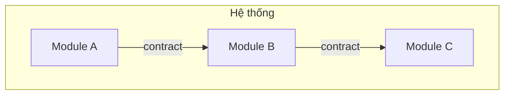

# Spec Tổng thể: <Tên Dự án>

## Bối cảnh

### Vấn đề cần giải quyết
<!-- Mô tả ngắn gọn vấn đề, ai bị ảnh hưởng, tại sao cần giải quyết -->

### Mục tiêu
<!-- Liệt kê 3-5 mục tiêu cụ thể, đo lường được -->

### Phạm vi
- **Trong phạm vi**: ...
- **Ngoài phạm vi**: ...

## Kiến trúc Tổng thể

### Công nghệ sử dụng
<!-- Tech stack và lý do chọn -->

### Quyết định kiến trúc quan trọng
<!-- Liệt kê các quyết định lớn, ghi chi tiết trong docs/ai/decisions/ -->

## Danh sách Modules

| Module | Mô tả | Owner | EST | Phụ thuộc | Trạng thái |
|--------|--------|-------|-----|-----------|------------|
| module-a | ... | - | Xd | - | draft |
| module-b | ... | - | Xd | module-a | draft |

**Tổng EST**: X days

## Contracts giữa Modules

| Contract | Giữa | Loại | File |
|----------|-------|------|------|
| contract-1 | module-a ↔ module-b | API / Event / Shared DB | `contracts/module-a--module-b.md` |

## Phân công & Timeline

| Phase | EST | Ai tham gia |
|-------|-----|-------------|
| Plan (spec tổng thể) | ... | ... |
| Spec module | ... | ... |
| Review | ... | ... |
| Implement | ... | ... |
| Gate review | ... | ... |
| Integrate | ... | ... |

## Ràng buộc & Giả định

### Ràng buộc
<!-- Kỹ thuật, business, thời gian -->

### Giả định
<!-- Những điều giả định là đúng -->

## Câu hỏi Mở

- [ ] ...
- [ ] ...
