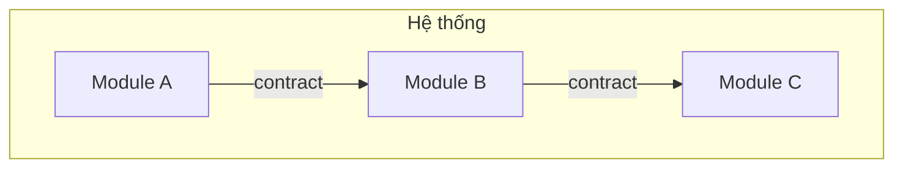

# Spec Tổng thể: <Tên Dự án>

## Bối cảnh

### Vấn đề cần giải quyết
<!-- Mô tả ngắn gọn vấn đề, ai bị ảnh hưởng, tại sao cần giải quyết -->

### Mục tiêu
<!-- Liệt kê 3-5 mục tiêu cụ thể, đo lường được -->

### Phạm vi
- **Trong phạm vi**: ...
- **Ngoài phạm vi**: ...

## Kiến trúc Tổng thể

### Công nghệ sử dụng
<!-- Tech stack và lý do chọn -->

### Quyết định kiến trúc quan trọng
<!-- Liệt kê các quyết định lớn, ghi chi tiết trong docs/ai/decisions/ -->

## Danh sách Modules

| Module | Mô tả | Owner | Phụ thuộc | Trạng thái |
|--------|--------|-------|-----------|------------|
| module-a | ... | dev-a | - | draft |
| module-b | ... | dev-b | module-a | draft |
| module-c | ... | dev-c | module-a, module-b | draft |

## Contracts giữa Modules

| Contract | Giữa | Loại | File |
|----------|-------|------|------|
| contract-1 | module-a ↔ module-b | API / Event / Shared DB | `contracts/module-a--module-b.md` |
| contract-2 | module-b ↔ module-c | API | `contracts/module-b--module-c.md` |

## Phân công & Timeline

| Phase | Thời gian dự kiến | Ai tham gia |
|-------|-------------------|-------------|
| Kickoff (spec tổng thể) | ... | Cả team |
| Spec module | ... | Mỗi dev viết module mình own |
| Review chéo | ... | Dev review chéo cho nhau |
| Implement | ... | Mỗi dev implement module mình |
| Integrate | ... | Cả team |

## Ràng buộc & Giả định

### Ràng buộc
<!-- Kỹ thuật, business, thời gian -->

### Giả định
<!-- Những điều team giả định là đúng -->

## Câu hỏi Mở
<!-- Những điều chưa được giải quyết -->

- [ ] ...
- [ ] ...
